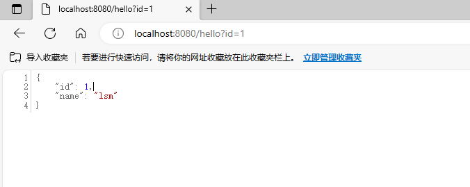

# tiny_tomcat

Netty based Tomcat web application server

## 自己动手造轮子系列（二）

基于Netty实现tomcat

20年的时候写过一个基于Netty的简易版Tomcat，当时是为了学习Netty的使用，实现了一个简单的Servlet容器。原文地址：[https://blog.csdn.net/qq_38258310/article/details/112305744](https://blog.csdn.net/qq_38258310/article/details/112305744)

其他系列

. [自己动手造轮子系列（一）- Golang实现Redis cli](https://github.com/lsm1998/go_redis_cli)

## 环境依赖

* JDK 1.8
* Maven 3.x
* Netty 4.1.51.Final
* SnakeYaml 1.25
* Gson 2.8.0

## 使用方法

#### 启动

加载完maven依赖后进入`src/main/java/example`目录下执行`example.TomcatApp`的main方法即可启动

#### 配置

* 配置文件位于`src/main/resources`目录下的`tomcat.yml`文件，可以配置端口号、静态资源目录、Servlet包名等
* 静态资源放置于`src/main/resources/static`目录下

#### 自定义Servlet

使用@WebServlet注解即可将Servlet注册到容器中，使用url参数指定路由，例如：

````java
@WebServlet(url = "/hello")
public class HelloServlet extends HttpServlet
{}
````

实现Servlet的doGet和doPost方法完成业务处理，例如：

````java
@Override
public void doGet(HttpServletRequest request, HttpServletResponse response) throws Exception
{
    doPost(request, response);
}

@Override
public void doPost(HttpServletRequest request, HttpServletResponse response) throws Exception
{
    response.getWrite().write("you response");
}
````

#### 访问

````
http://localhost:8080/hello?id=1
````




````
http://localhost:8080/index.html
````

